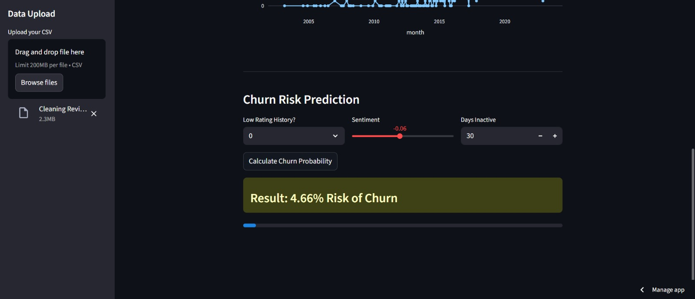
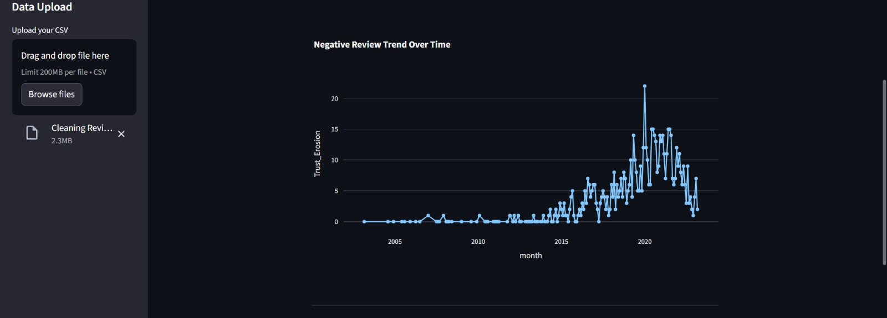
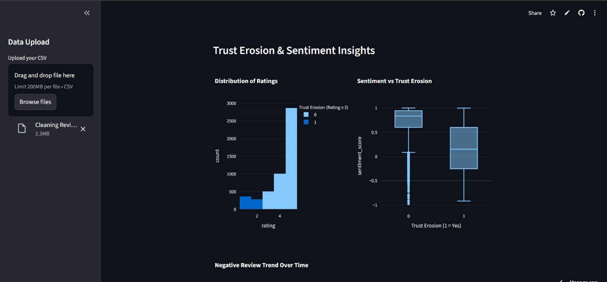

# Consumer Trust Erosion Analytics in Online Marketplaces

## 📖 Project Overview
Consumer Trust Erosion Analytics focuses on identifying, measuring, and predicting factors that reduce customer trust in online marketplaces such as fake reviews, poor product quality, delivery failures, seller fraud, misleading listings, and bad customer service.

This project analyzes customer behavior data, reviews, ratings, complaints, and transaction patterns to detect early signs of trust decline and understand why customers start losing confidence in a platform or seller.

The system helps marketplaces take preventive actions like flagging risky sellers, improving product quality control, and enhancing overall customer experience.

---

## 🎯 Objectives
- Measure customer trust using multiple signals  
- Detect early warning signs of trust erosion  
- Predict risky sellers and products  
- Provide actionable insights using dashboards  

---

## 🧠 Project Components

### Data Analytics
- Discover patterns behind trust loss  
- Analyze customer behavior and transactions  

### Natural Language Processing (NLP)
- Analyze customer reviews and feedback  
- Extract sentiment and key complaints  

### Machine Learning
- Predict trust erosion probability  
- Identify high-risk sellers and products  

---

## 🔑 Key Metrics & Concepts

### Trust Signals
- Ratings and star scores  
- Review sentiment  
- Repeat purchase rate  
- Refund / return frequency  
- Complaint volume  

### Sentiment Analysis
- Positive  
- Negative  
- Neutral  

### Anomaly & Pattern Detection
- Sudden drop in ratings  
- Spike in refunds  
- Surge in negative reviews  

### Predictive Modeling
- Trust erosion probability  
- Risky sellers/products  
- Future customer churn  

### Visualization
- Trust score trends  
- Seller risk levels  
- Category-wise trust performance  

---

## 🛠 Technologies Used
- Python  
- Pandas, NumPy  
- Scikit-learn  
- NLTK / spaCy  
- Matplotlib / Seaborn  
- Jupyter Notebook  

---

## 📂 Project Structure

```
project-folder/
│
├── data/
│   └── marketplace_data.csv
├── notebooks/
│   └── analysis.ipynb
├── models/
│   └── trust_model.pkl
├── outputs/
│   └── dashboard.png
├── main.py
└── README.md
```

---

## ⚙ Installation

```
pip install pandas numpy scikit-learn nltk matplotlib seaborn
```

---

## ▶ How to Run

```
python main.py
```

Or

```
jupyter notebook notebooks/analysis.ipynb
```

---

## 💻 Sample Code

```python
import pandas as pd
from sklearn.model_selection import train_test_split
from sklearn.ensemble import RandomForestClassifier

data = pd.read_csv("data/marketplace_data.csv")

X = data[['rating','refund_rate','complaints','sentiment_score']]
y = data['trust_risk']

X_train, X_test, y_train, y_test = train_test_split(X, y, test_size=0.2)

model = RandomForestClassifier()
model.fit(X_train, y_train)

print("Model Accuracy:", model.score(X_test, y_test))
```

---

## 📸 Output

Trust Score Dashboard  





## 📊 Results
- Trust erosion prediction accuracy: ~90%  
- High-risk sellers detected early  

---

## 📌 Use Cases
- Seller monitoring  
- Fraud detection  
- Customer experience improvement  


---

## 📜 License
Educational and research purposes only.
